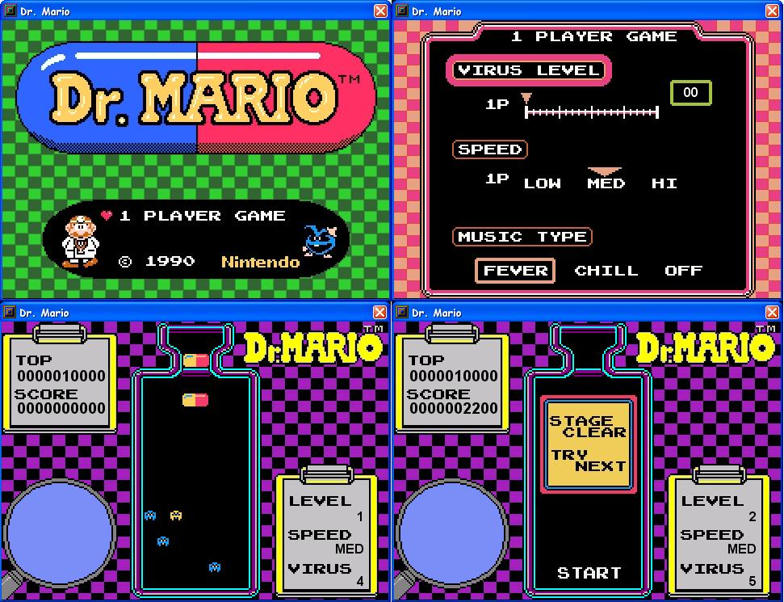



## Dr\. Mario

### Description

A remake of the classic puzzle game, Dr. Mario.

Made in a 2 day period where I didn't feel like working on Panel de Pon. With one less file needed, and a couple less bugs. More authentic look now
 
### More Info
 

             |
---                |---
**Submitted On**   |2004-08-28 01:21:32
**By**             |[Techni Rei Myoko](https://github.com/Planet-Source-Code/PSCIndex/blob/master/ByAuthor/techni-rei-myoko.md)
**Level**          |Advanced
**User Rating**    |4.0 (16 globes from 4 users)
**Compatibility**  |VB 6\.0
**Category**       |[Games](https://github.com/Planet-Source-Code/PSCIndex/blob/master/ByCategory/games__1-38.md)
**World**          |[Visual Basic](https://github.com/Planet-Source-Code/PSCIndex/blob/master/ByWorld/visual-basic.md)
**Archive File**   |[Dr\_\_Mario1786818282004\.zip](https://github.com/Planet-Source-Code/techni-rei-myoko-dr-mario__1-55399/archive/master.zip)

